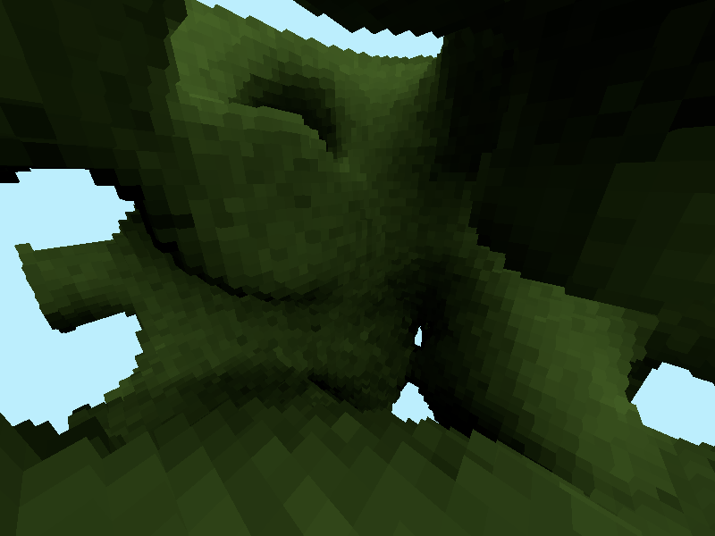

# Voxel Renderer

This is the third voxel renderer I have written.

Voxels have a color, brightness and normal (normal quantized to 8-bits).

Lighting is done in world space and cached in voxel brightness values.
Voxels are drawn by converting to a mesh (on CPU) and rasterizing (on GPU).

